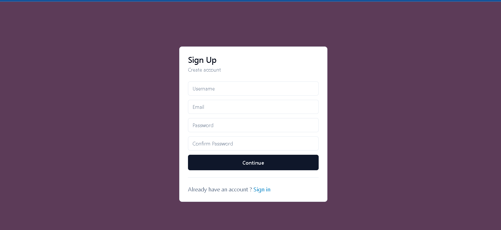
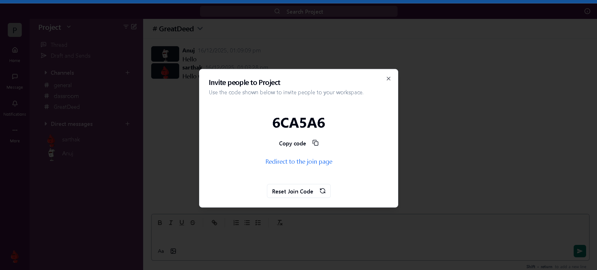
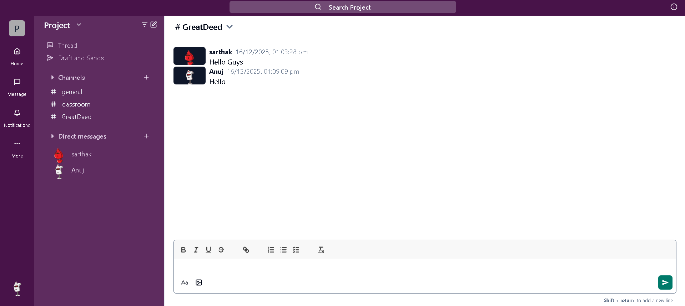

# Frontend - Messaging App

## Overview

A modern team collaboration platform frontend built with React and Vite, enabling real-time messaging and seamless communication.

### Authentication & Invite
 

### Chat Interface


## Tech Stack

- **Framework:** React 18.3
- **Build Tool:** Vite 6
- **API Communication:** Axios, Socket.IO Client
- **Styling:** Tailwind CSS with Radix UI components and ShadCN
- **State Management:** TanStack React Query
- **Routing:** React Router DOM
- **Rich Text:** Quill Editor

## Prerequisites

- Node.js (v14+)
- npm or yarn

## Setup & Installation

```bash
npm install
npm run dev
```

Application runs at `http://localhost:5173`

## Environment Variables

Create a `.env` file with:

```
VITE_BACKEND_API_URL=http://localhost:3000/api/v1
VITE_API_URL=http://localhost:3000
```

## Available Scripts

- `npm run dev` - Start development server
- `npm run build` - Create production build
- `npm run lint` - Run ESLint
- `npm run preview` - Preview production build

## Project Structure

```
src/
├── components/    # Reusable UI components
├── pages/         # Route pages
├── services/      # API services
├── App.jsx
└── main.jsx
```

## Key Features

- Real-time messaging via Socket.IO
- User authentication
- Message history
- Responsive design with Tailwind CSS
- Toast notifications
- Rich text editor support
- Resizable panels

## Backend Repository

[Messaging App Backend](https://github.com/SarthakBhandari01/Messaging_app_backend)

## Contributing

Submit pull requests to enhance the platform.

## Architecture & Engineering Highlights

- Modular frontend using Atomic Design
- Clean backend architecture following MVC
- Scalable file storage with AWS S3
- Background jobs with Redis + Bull
- Secure JWT-based authentication
- Optimized real-time messaging with Socket.IO
